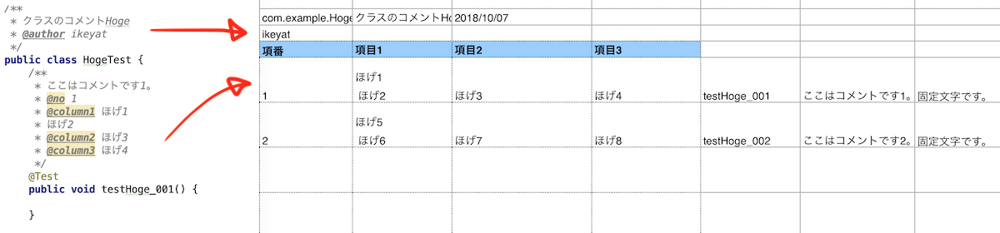

# javadoc2xls
[](https://app.codacy.com/app/tm-ikeya/javadoc2xls?utm_source=github.com&utm_medium=referral&utm_content=ikeyat/javadoc2xls&utm_campaign=Badge_Grade_Dashboard)
[](https://travis-ci.org/ikeyat/javadoc2xls)
[](https://opensource.org/licenses/MIT)
[](https://search.maven.org/search?q=g:%22io.github.ikeyat.tools.javadoc2xls%22%20AND%20a:%22javadoc2xls-tool%22)

## Motivation

This tool aims to generate test case documents (Excel worksheet) from javadoc on JUnit classes.
In general, test case documents are required in enterprise software developments.
It usually becomes very difficult to keep the consistency between test case documents and JUnit code when there are some modifications.
This tool will resolve this problem and keep the consistency with its one-way generation mechanisim.

## Image

Write test code with some javadoc including tags.
Then generate javadoc with javadoc2xls, get Excel worksheet.



## Get Started

1. Download and look at the example  
    See the ``sample`` project.
    https://github.com/ikeyat/javadoc2xls/tree/master/sample
    
    See JUnit code (``HogeTest.java``, ``FugaTest.java``) in ``src/java/test``. You will find javadoc on these classes.
    
    Next, see the template Excel worksheet in ``report/template``. You will find worksheet with some annotated cells.
    
    Next, see ``pom.xml``. There is a definition to switch default javadoc generator to this tool as follows.
    You can modifiy the configuration if you want to tune.
    For example, output directory, file name convention, etc...
    
    ```xml
            <plugin>
                <groupId>org.apache.maven.plugins</groupId>
                <artifactId>maven-javadoc-plugin</artifactId>
                <configuration>
                    <doclet>jp.ikeyat.tools.javadoc2xls.Javadoc2XlsDoclet</doclet>
                    <docletArtifact>
                        <groupId>io.github.ikeyat.tools.javadoc2xls</groupId>
                        <artifactId>javadoc2xls-tool</artifactId>
                        <version>1.0.0.RELEASE</version>
                    </docletArtifact>
                    <encoding>UTF-8</encoding>
                    <useStandardDocletOptions>false</useStandardDocletOptions>
                    <additionalparam>
                        -template ${project.basedir}/report/template/sheet_01.xlsx
                        -reportdir ${project.basedir}/report/testlist
                        -reportfilename {0}_TestCaseaa({1}).xlsx
                        -sorttag @no
                        -sheetindex 0
                    </additionalparam>
                </configuration>
            </plugin>
    ```
  
1. Try the example!  
    Go to the console, please execute Maven as follows to generate javadoc of test classes.
    Don't forget to switch Maven profile (``-P``).
    ```console
    $ cd sample
    $ mvn javadoc:test-javadoc -P javadoc2xls
    ```


    Afeter execution, go to the ``report/testlist`` folder. You can find generated Excel worksheets with javadoc contents if Maven complete successfully.
    

## Spec
### Input and Output
* Input
    - Template worksheet with variables (1 file)
        - Legacy Excel workbook format (*.xls)
        - OOXML(Office Open XML) format (*.xlsx)
    - JUnit classes annotated with ``@Test`` (N files)
* Output
    - Generated test case documents (N workbook files)
        - Format should be same as the template.

### Execution parameters
|Parameter       | Description                                  |
|----------------|----------------------------------------------|
|-template       | Path to a template Excel worksheet file.     |
|-reportdir      | Output directory path.                       |
|-reportfilename | Name convention of output worksheet files. ``{0}`` variable means test class id (auto generated), ``{1}`` variables means class name. |
|-sorttag        | Any javadoc tag on test methods to sort test methods. |
|-sheetindex     | Target sheet to be generated. This tool can handle only 1 sheet for each worksheet. |
|-converter      | Switch converter that converts original javadoc into any text with a certain rule. ```normal`` or ```removehtml`` is available|


### Worksheet variables
Variables are annotation to be replaced with actual values such as javadoc contents, class name, method name, timestamp, static text, etc...
To write variables on worksheet template, please follow a simple grammar as follows.

#### Variable binding mode
This tool supports 2 variable binding modes. You can choose any mode for your purpose.

* Cell binding mode
    binds value at once. The replacement is never repeated for each test method.
    Therefore this is used to describe overview of a test class (ex. target class name).
* Row binding mode 
    binds value repeatedly for each row of the worksheet.
    Number of repeats is the number of test method in a test class.
    This is used to describe each test method (ex. test method name).
    
#### Syntax

```
#{binding mode}{variable}
```

For example, 
- ``#cell#className`` means "binds ``#className`` variable with cell binding mode"
- ``#row#methodName`` means "binds ``#methodName`` variable with row binding mode"

#### Variables
|Variable        | ``#cell`` | ``#row`` | Description                            | Example           | Example Output        |
|----------------|-----------|----------|----------------------------------------|-------------------|-----------------------|
|``#className``  |OK         |NG        |Write a full name of the test class.    |``#cell#className``|``com.example.fuga.FugaTest``|
|``#methodName`` |NG         |OK        |Write a test method name.               |``#row#methodName``|``testFuga_001``       |
|``#commentText``|OK         |OK        |Write a javadoc comment of each test method.|``#row#commentText``|``This is a comment``|
|``#staticText#{any text}`` |NG   |OK   |Write a given static text.              |``#row#staticText#Passed!``|``Passed!``    |
|``#date#{format}``|OK       |OK        |Write a runtime system timetamp with given format. |``#row#date#yyyy/MM/dd``|``2018/08/22``|
|``@{tag name}``|OK         |OK         |Write a value in the javadoc tag of each test method. |``#row@expected``|``return "1234"``|


## Hints
If you have the ``maven-javadoc-plugin`` config for javadoc2xls, you cannot get standard HTML style javadoc of your test code.
Maven profile will help this problem. I recommend that you have the config for javadoc2xls with the minor Maven profile, not the default profile for the people who don't know javadoc2xls.

Other cases, if you would like to get standard javadoc of test code additionally, custom tag option will be helpful. You can find a simple [example](https://github.com/ikeyat/javadoc2xls/blob/master/sample/pom.xml).
For more detail, see https://maven.apache.org/plugins-archives/maven-javadoc-plugin-2.8.1/examples/tag-configuration.html.

## Migration from old version
javadoc2xls was published at https://github.com/ikeyat/xls2conf/tree/master/javadoc2xls.
If you are an old user, please migrate javadoc2xls as follows.

1. Change a ``groupId`` and ``artifactId`` of javadoc2xls in a ``pom.xml`` of your application.
    - Replace ``groupId`` from ``com.example.tools.xls2conf.javadoc2xls`` to ``io.github.ikeyat.tools.javadoc2xls``.
    - Replace ``artifactId`` from ``javadoc2xls`` to ``javadoc2xls-tool``

1. Change a package name of ``Javadoc2XlsDoclet`` in a ``pom.xml`` of your application.
   - Replace ``<doclet>com.example.tools.xls2conf.javadoc2xls.Javadoc2XlsDoclet</doclet>`` to ``<doclet>jp.ikeyat.tools.javadoc2xls.Javadoc2XlsDoclet</doclet>``

1. Don't require to build the tool by yourself.
    javadoc2xls has been managed at Maven Central. It's available without your buiding as other major OSS libraries are.
